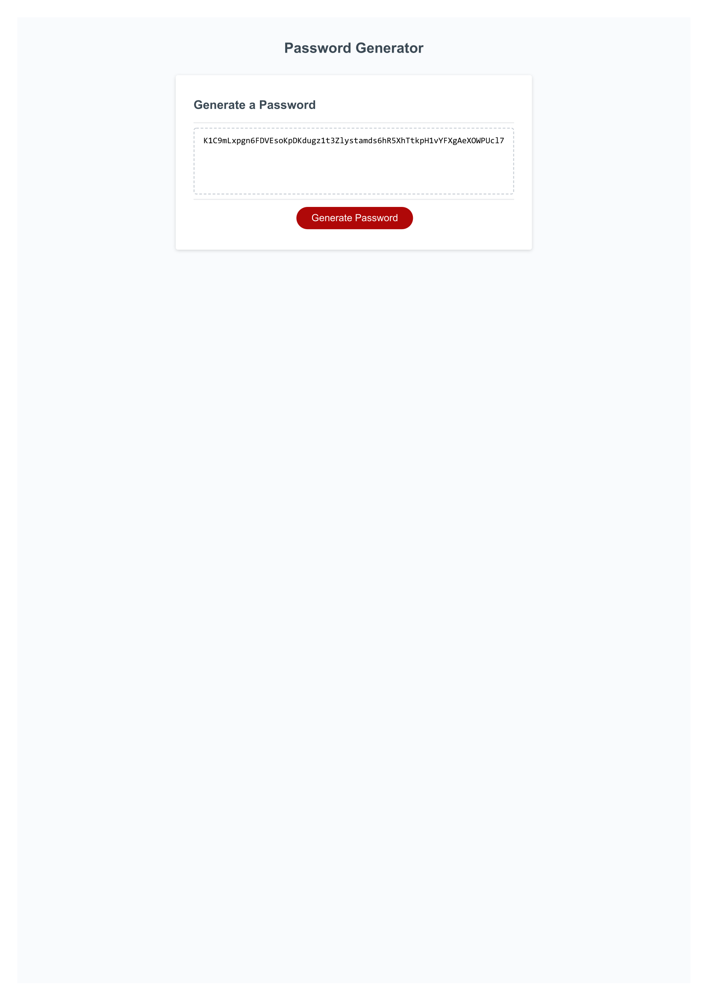

# UNH_bootcamp-03-Sauter-Password-Generator
On demand, generate a password that is hard to guess with user-specified constraints.  The user may choose the length of the password and
has some choice of which characters are allowed.

The program takes care to avoid generating the same password when
used a second time with the same constraints.

The URL of the application is https://github.com/JohnSauter/UNH_bootcamp-03-Sauter-Password-Generator/settings/pages .
It is deployed at https://johnsauter.github.io/UNH_bootcamp-03-Sauter-Password-Generator/ .

Here is an image of the application after generating a password:

